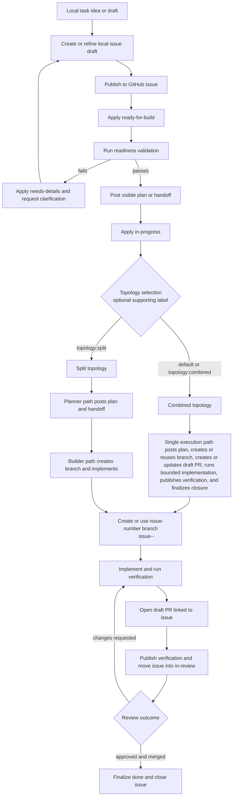
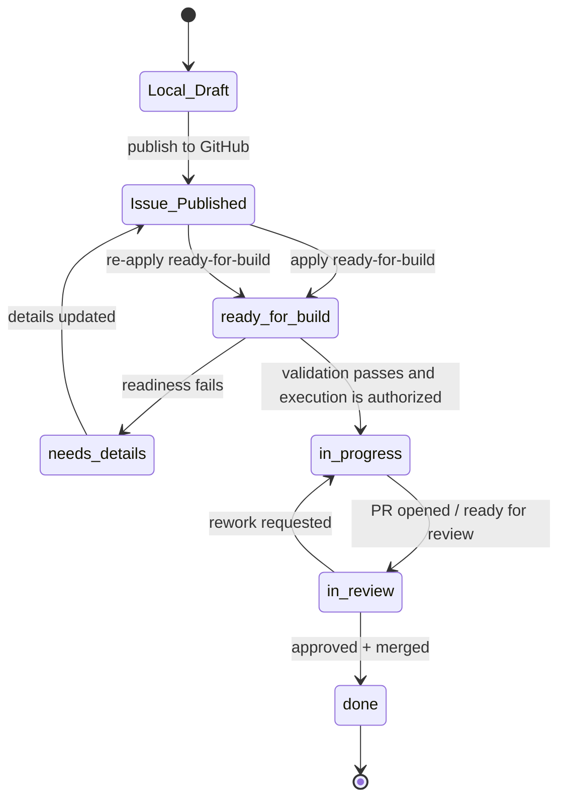

# Lifecycle Flow (Issue-First)

Everything starts with an issue.

The lifecycle is designed so local planning happens first, agent implementation waits until a GitHub issue is published, validated via readiness checks, and moved into `in-progress`.

## End-To-End Flow

## Lifecycle States And Meaning

Required lifecycle labels:

- `ready-for-build`: issue has been published and is awaiting or undergoing readiness validation
- `in-progress`: readiness validation has passed and implementation is authorized
- `in-review`: implementation is complete enough for formal review
- `done`: PR merged and lifecycle complete

Common supporting labels (not lifecycle states):

- `needs-details`: issue contract failed validation and needs clarification
- `topology:combined`: planner and executor behavior are handled in one path
- `topology:split`: planner and builder are separated with explicit handoff
- `merge:human-required`: explicit manual merge gate (human-in-the-middle)
- `hold`, `needs-human`: pause or escalation controls

## Merge Policy

Default merge behavior is automation-first once repository verification and lifecycle conditions are satisfied.

Use `merge:human-required` when a human must review and merge manually.

`hold`, `needs-human`, and comment-based stop signals remain pause or interruption controls. They are not the primary long-term manual-merge policy signal.

## Label State Diagram

## Topology Rules

- Combined and split topologies both begin from the same issue and lifecycle labels.
- Topology labels are routing signals, not lifecycle replacements.
- If no topology label is present, default to combined.
- In split mode, planner and builder handoffs must remain visible in issue or PR context.
- Posting a plan or handoff may happen before `in-progress`, but implementation starts only after `in-progress`.
- Lifecycle advancement remains explicit and label-driven regardless of topology.
- Control plane and execution substrate remain separate concerns; GitHub may host visible state even when execution runs locally or elsewhere.

## Human Interrupt Authority

At any lifecycle stage, humans may pause, redirect, or stop execution.

This control is typically expressed through issue or PR comments and supporting labels such as `hold` or `needs-human`.

Agent autonomy is interruptible by humans through repository-defined control signals.

## Practical Checks Before `in-progress`

Before implementation starts:

- issue contains required sections (Context, Requirements, Acceptance Criteria, Target Files)
- readiness validation has passed
- visible plan or handoff has been posted where the repository expects it
- stop/hold conditions are clear to humans and agents
- branch and PR strategy are known for the repository

For the current `web-app` + GitHub runtime slice, a combined-path entrypoint can:

- advance the issue to `in-progress`
- publish the preflight plan visibly
- create or reuse the issue branch
- create or update the draft PR
- invoke the configured bounded implementation command through the local execution backend
- run lint, build, and browser validation through `--verify`
- publish verification results into the PR
- advance the issue to `in-review` after successful verification
- finalize merged PR completion into `done` and close the issue through `--finalize`

The current implementation backend is local-command driven. Hosted dispatcher and runner-backed backends remain separate substrate work.

## Outcome Contract

Work is complete when:

- acceptance criteria are met
- required verification passes
- PR is reviewed and merged
- lifecycle reaches `done`
